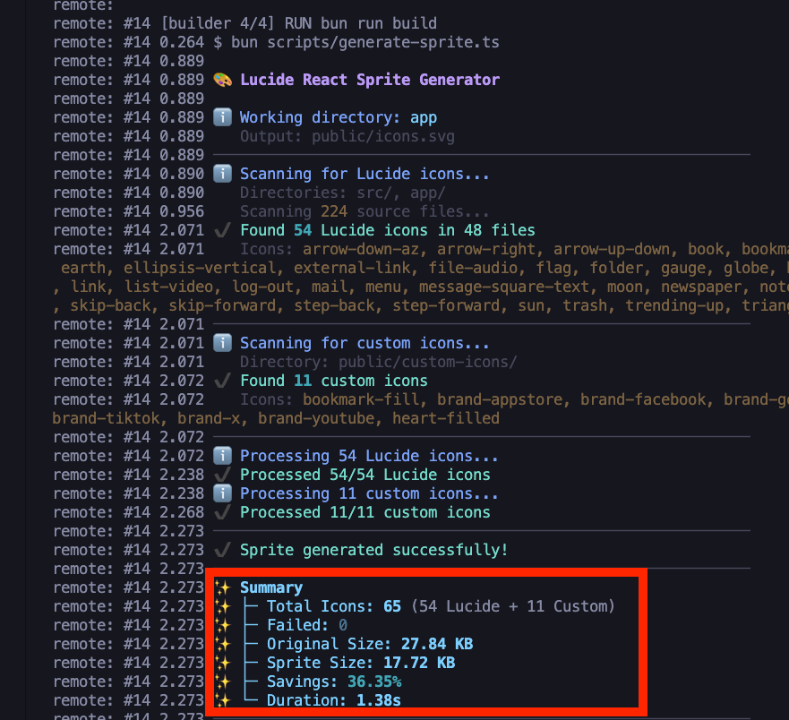

# lucide-react-sprite

A high-performance icon system for React applications that uses lucide-react components during development and generates a single, optimized SVG sprite for production builds.

## Installation

```bash
npm install lucide-react-sprite
```

```bash
yarn add lucide-react-sprite
```

```bash
pnpm add lucide-react-sprite
```

```bash
bun add lucide-react-sprite
```

## Usage

### 1. Use the components

Use the `<LucideIcon />` and `<CustomIcon />` components in your React application.

```jsx
import { LucideIcon, CustomIcon } from 'lucide-react-sprite'

function MyComponent() {
  return (
    <div>
      <LucideIcon name='activity' />
      <CustomIcon name='my-logo' />
    </div>
  )
}
```

### 2. Add custom icons

Place your custom SVG icons in the `public/custom-icons/` directory.

### 3. Generate the sprite

Run the `lucide-sprite` command to generate the SVG sprite.

**For Development:**
Use the `--all` flag to generate a sprite containing ALL available Lucide icons. This ensures you have access to any icon you might want to use while developing without needing to re-run the generator every time you add a new icon.

**For Production:**
Run without flags to scan your codebase and generate an optimized sprite containing ONLY the icons you actually use.

Add these scripts to your `package.json`:

```json
{
  "scripts": {
    "dev": "lucide-sprite --all && next dev",
    "build": "lucide-sprite && next build"
  }
}
```

This will generate a `public/icons.svg` file.

## How it works

Both `<LucideIcon />` and `<CustomIcon />` render an `<svg>` element with a `<use>` tag that points to the generated `icons.svg` sprite. This approach:

- ✅ **Minimizes network requests** - Single SVG sprite file
- ✅ **Reduces bundle size** - No JavaScript icon components
- ✅ **Zero configuration** - Works out of the box
- ✅ **Type-safe** - Full TypeScript support with `IconName` type
- ✅ **Optimized** - SVGO optimization built-in

The `lucide-sprite` CLI tool scans your project for `<LucideIcon />` usage and custom icons, and generates a single, optimized SVG sprite containing only the icons you need.

## Screenshots


